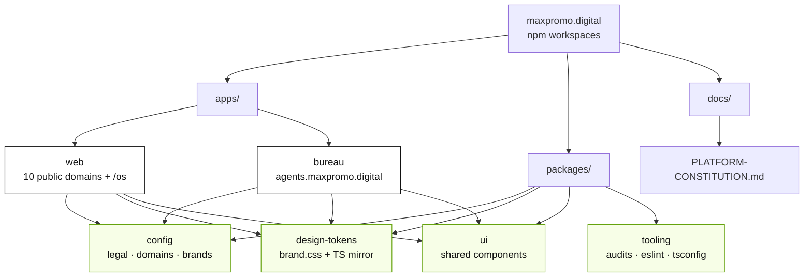
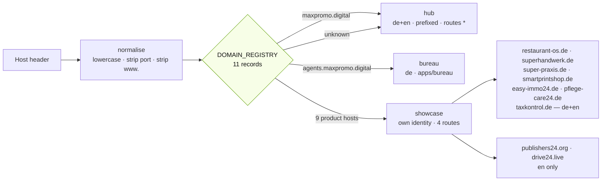
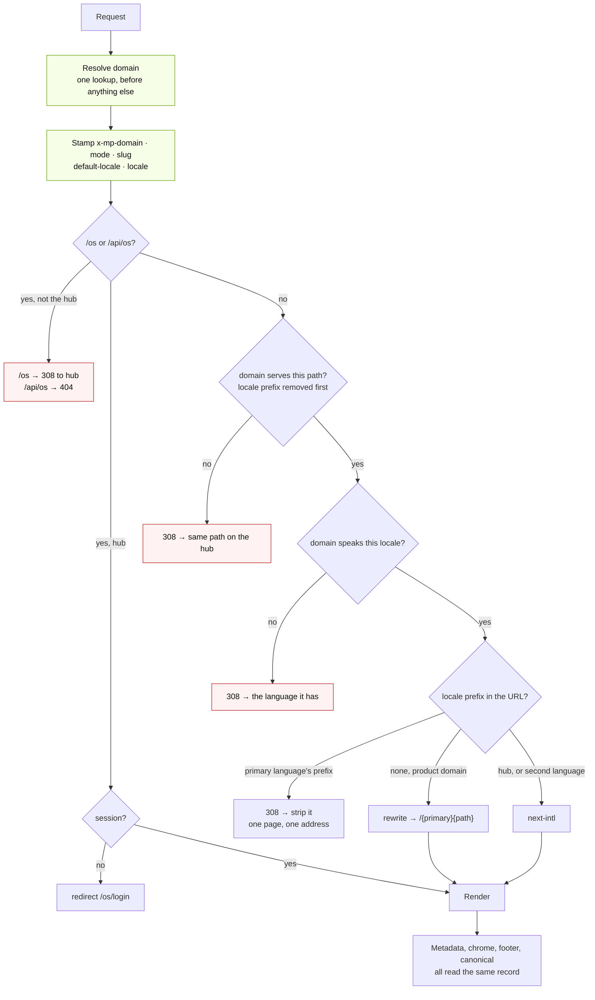
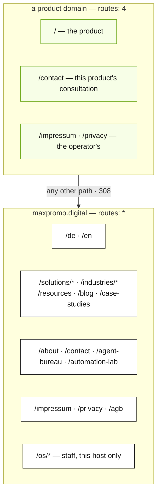
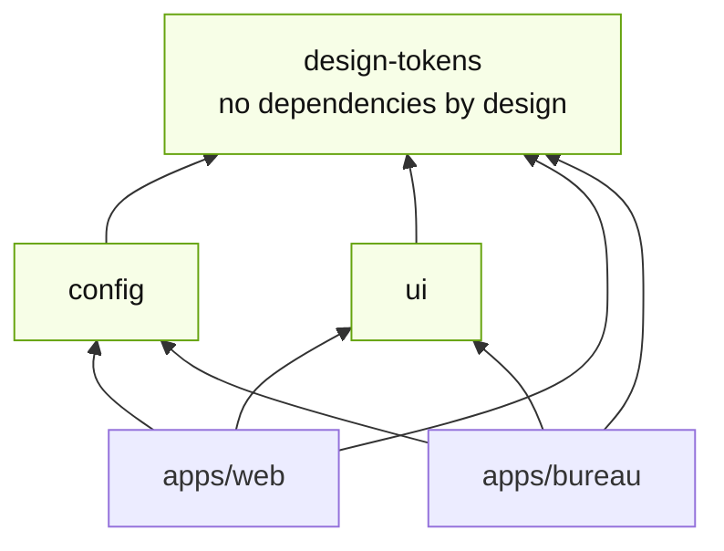
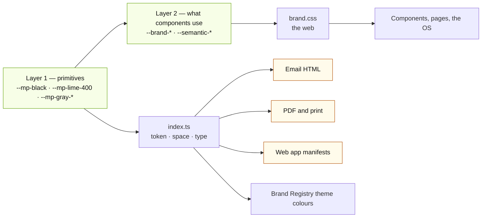
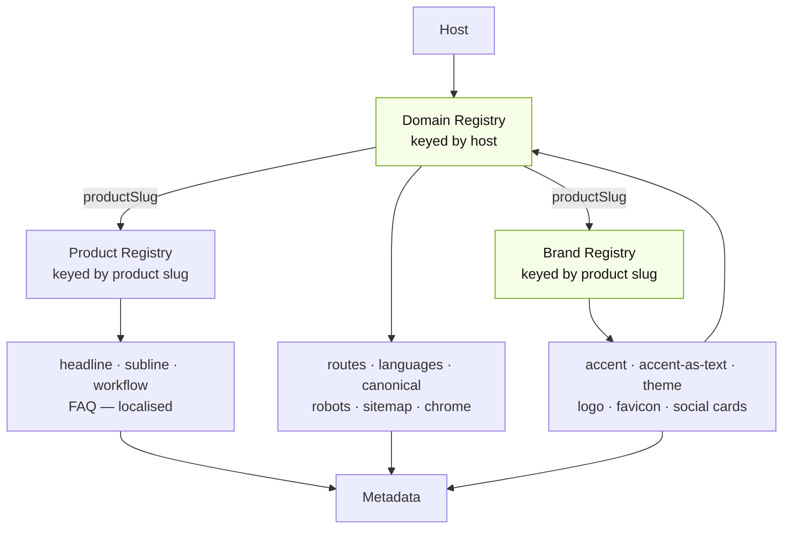
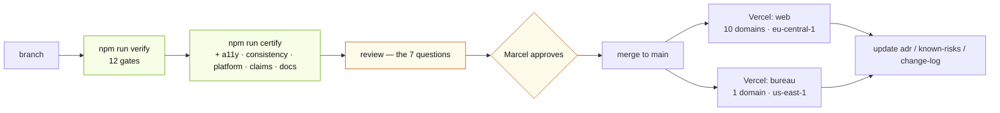
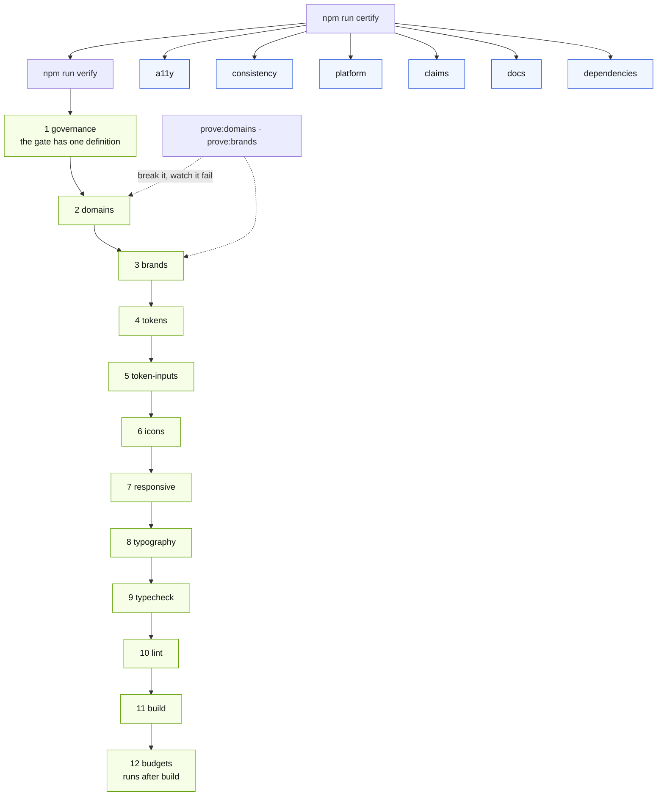
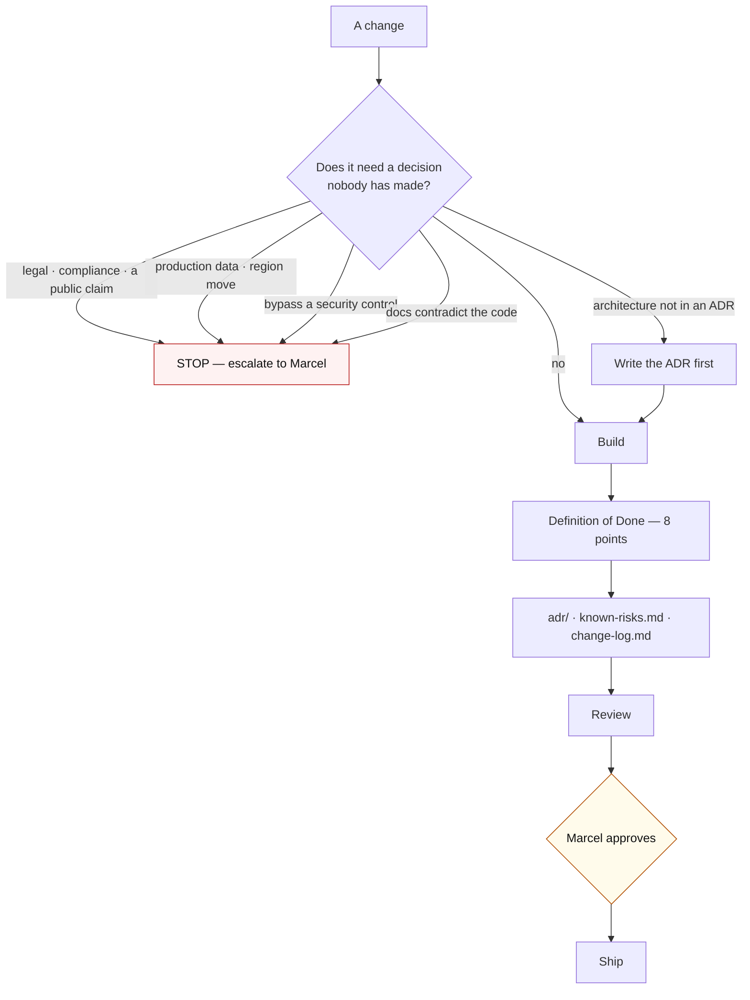

# Platform Diagrams

Ten diagrams for a senior engineer arriving at this repository. Each answers
one question and names the file that is the authority for it.

Nothing here is a second explanation. Where a diagram and its source file
disagree, the file is right — these are maps, and the territory is the code.

Start with §1 and §3. Between them they explain most of what is unusual about
this platform: one deployment serving ten public domains, and identity resolved
before anything else happens.

---

## 1. Repository layout

Dependencies point **downward only**. No package imports from an application —
`audit:platform` fails the build on it, which is why the Domain and Brand
registries live in `packages/config` and read product copy through an adapter
rather than importing `products.ts`.

Authority: **ADR-0001**, `architecture/platform.md`.

---

## 2. Domain Registry

An unknown host resolves to the hub rather than to nothing: local development,
Vercel previews and stray DNS all behave as the consultancy site.

The two English-only domains are English-only because that is the copy that
exists — see §7.

Authority: `packages/config/domains.ts`, **ADR-0008**.

---

## 3. Host resolution and the request lifecycle

**Why isolation runs before locale routing.** "Does this domain serve `/about`"
is a question about the domain, not about the URL's spelling. Asked afterwards
it would have to be asked once per locale form, which is how a rule ends up
enforced on `/de/about` and not on `/about`.

**Why the locale is stamped.** A product domain shows no prefix for its own
language, so the middleware rewrites `/` to `/en` internally and next-intl
never sees that request — `getLocale()` then answers with the routing default.
Both English-led domains served every page as `<html lang="de">` until the
middleware started stating the answer.

Authority: `apps/web/middleware.ts`.

---

## 4. Routing: what each domain serves

Sixteen public routes answered on every product domain before v13.0, chrome-less,
including the contact form that collects personal data and carried no links at
all. Four answer now.

Authority: `PRODUCT_ROUTES` in `packages/config/domains.ts`.

---

## 5. Shared packages and what depends on what

The token package is dependency-free so it cannot load a webfont. It **names**
one — `--brand-font-sans: var(--font-inter), …` — and each application defines
it. Agent Bureau did not, for a year, and rendered in Segoe UI while the
website rendered in Inter. An undefined `var()` does not warn.

Authority: **ADR-0006**. Gate: `check:token-inputs`.

---

## 6. Design tokens: two layers, and the surfaces that cannot use them

The amber surfaces have no CSS engine of ours. A custom property written into
an email resolves to nothing — the same silence as an undefined one, and
invisible to the check that looks for undefined ones, because these variables
*are* defined; they simply travel somewhere that cannot read them.

`lib/email.ts` wrote `var(--space-2)` seventy-one times into transactional email
markup and `emailHtml.ts` set the invoice letterhead's company name to
`var(--brand-surface)` on a near-black band. Gate: `check:token-inputs`.

Authority: `brand/design-system.md`, `packages/design-tokens/`.

---

## 7. Identity: the two registries

Three registries, three questions: **which property is this request for**,
**what does this product look like**, **what does it say**. Keyed differently on
purpose — a domain by host, a brand and a product by slug — because one product
reaches a visitor through more than one surface.

The Domain Registry reads its social card and favicon *from* the Brand Registry
rather than restating them. Two declarations of one image is how the
hyphenation of `real-estate-os` gets right in one place and wrong in the other.

Authority: `packages/config/domains.ts`, `packages/config/brands.ts`.

---

## 8. Deployment flow

Two Vercel projects, two databases, two regions, independent rollback. A bad
deploy on `web` is a ten-domain outage, which is why nothing else can cause one.

The bureau's `us-east-1` region is a live compliance question, not a design —
see `governance/known-risks.md`.

Authority: **ADR-0001**, `deployment/vercel.md`.

---

## 9. Certification pipeline

Budgets run **last** because there is nothing to measure until the build has
produced it, and the check errors rather than passing when no application has
been built.

Governance runs **first** because it checks that the rest of the table is true.
Three things once claimed to be the merge gate, and the one CI ran was a stale
subset of it — reporting green while three gates had never run.

The dotted edges are the ADR-0004 discipline made re-runnable: those two
harnesses break their registries one way at a time and assert the audit reports
each one.

Authority: `governance/standards.md`, **ADR-0004**.

---

## 10. Governance flow

No agent approves its own work, releases, security exceptions, architecture
changes or production deploys.

Authority: `openclaw/governance.md`, `PLATFORM-CONSTITUTION.md` §19.

---

_See `PLATFORM-CONSTITUTION.md` for the platform's rules, and `adr/` for why
each one exists._
